# 🔐 Veri-Doc - Blockchain Document Verification Platform

<div align="center">

[](https://choosealicense.com/licenses/mit/)
[](https://reactjs.org/)
[](https://tailwindcss.com/)
[](https://ethereum.org/)

A secure, decentralized platform for document verification using blockchain technology.

[Live Demo](https://veri-doc.vercel.app/) · [Report Bug](https://github.com/yourusername/veri-doc/issues) · [Request Feature](https://github.com/vedantanand17/veri-doc/issues)

</div>

## 🌟 Features

- **Secure Document Verification** - Tamper-proof document authentication
- **Blockchain Integration** - Immutable record keeping using Ethereum
- **Batch Processing** - Verify multiple documents simultaneously
- **Real-time Status** - Instant verification results
- **User-friendly Interface** - Clean, modern UI with smooth animations
- **Mobile Responsive** - Works seamlessly across all devices

## 🔄 How It Works

```mermaid
graph TD
    A[Upload Document] -->|PDF/Image| B[Generate Hash]
    B -->|keccak256| C[Store on Blockchain]
    C -->|Smart Contract| D[Document Registered]

    E[Verify Document] -->|Upload for Verification| F[Generate Hash]
    F -->|Compare| G{Check Blockchain}
    G -->|Match Found| H[Document Verified ✓]
    G -->|No Match| I[Document Unverified ✗]
```



### 📝 Process Overview

1. **Document Upload**

   - Drag & drop or click to upload documents
   - Supports PDF, images, and other document formats
   - Secure client-side processing

2. **Hash Generation**

   - Uses keccak256 cryptographic algorithm
   - Creates unique document fingerprint
   - Ensures document integrity and privacy

3. **Blockchain Storage**

   - Hash stored on Ethereum blockchain
   - Immutable record creation
   - Smart contract integration for security

4. **Verification Process**
   - Quick document verification
   - Real-time blockchain comparison
   - Instant verification status
   - Timestamp verification

## 🛠️ Tech Stack

- **Frontend**

  - React.js
  - Tailwind CSS
  - Framer Motion
  - Wagmi
  - Vite

- **Blockchain**
  - Ethereum
  - Smart Contracts
  - ethers.js

## 🚀 Getting Started

### Prerequisites

- Node.js 16+
- npm or yarn
- MetaMask wallet

### Installation

1. Clone the repository

```bash
git clone https://github.com/yourusername/veri-doc.git
cd veri-doc
```

2. Install dependencies

```bash
npm install
# or
yarn install
```

3. Create environment variables

```bash
cp .env.example .env
```

4. Start development server

```bash
npm run dev
# or
yarn dev
```

## 📱 Usage

### Document Registration


### Document Verification


## 🤝 Contributing

Contributions make the open-source community amazing! Any contributions you make are **greatly appreciated**.

1. Fork the Project
2. Create your Feature Branch (`git checkout -b feature/AmazingFeature`)
3. Commit your Changes (`git commit -m 'Add some AmazingFeature'`)
4. Push to the Branch (`git push origin feature/AmazingFeature`)
5. Open a Pull Request

## 📄 License

Distributed under the MIT License. See `LICENSE` for more information.

## 📞 Contact

<!-- Your Name - [@yourtwitter](https://twitter.com/yourtwitter) - email@example.com -->

Project Link: [github.com/VedantAnand17/Veri-Doc-frontend](github.com/VedantAnand17/Veri-Doc-frontend/)

## 🙏 Acknowledgments

- [React Documentation](https://reactjs.org/)
- [Ethereum Documentation](https://ethereum.org/developers/)
- [Tailwind CSS](https://tailwindcss.com/)
- [OpenZeppelin](https://openzeppelin.com/)
